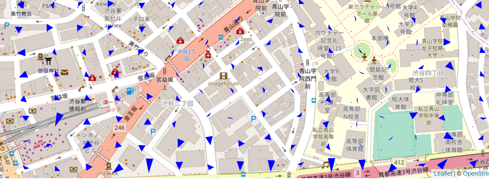

地形の傾きを下る方向に矢印や三角で表すことで傾斜を表現する手法の実証コードです。二次元表示なのでweb上の地図と相性がよく、防災や地理的コンテンツと組み合わせることで様々な応用が可能です。

## 使い方

まずダウンロード及び(必要であれば)解凍し、ディレクトリに移動してください。
傾斜の抽出部分はpythonでnumpyにのみ依存しています。インストールされていない場合は

```
pip install -r 
```

次にwebサーバーを起動します

```
python -m http.server 8000
```

localhost:8000/map.htmlにアクセスするとサンプルの地図が表示されます

## アルゴリズム

以下のカーネルで標高のメッシュデータを畳み込み、実部を経度、虚部を緯度としています。

1/2^0.5 - 1/2^0.5×i　|　-i　|　-1/2^0.5 - 1/2^0.5×i

1/2^0.5 　　　　　　|　0　|　-1/2^0.5

1/2^0.5 + 1/2^0.5×i　|　i　|　-1/2^0.5 + 1/2^0.5×i


